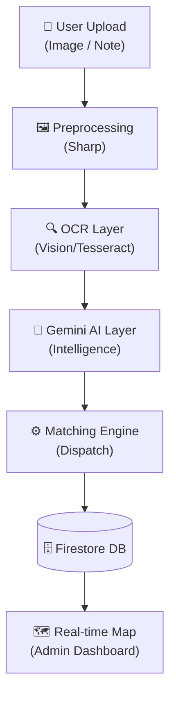

# 🌉 SevaSetu: AI-Powered Decentralized Relief Orchestrator

**"Bridging the gap between ground-level needs and volunteer action through Gemini AI and Trust-based Decentralization."**

---

## 🌟 The Vision

In disaster and social relief, **seconds save lives**. Traditional centralized systems suffer from administrative bottlenecks, data noise, and delayed response. 

**SevaSetu** is a self-orchestrating platform that transforms messy real-world data into actionable relief tasks using a sophisticated AI pipeline and a community-driven trust engine.

---

## 🧠 Core Intelligence: The Gemini Layer

SevaSetu goes beyond simple data entry. Our **Intelligence Layer** (powered by **Google Gemini-1.5-Flash**) acts as a 24/7 digital dispatcher.

### 🔍 Multimodal Intake Pipeline
1.  **Visual Input**: User uploads a photo of a handwritten note, a situational image, or a paper form.
2.  **OCR Step**: Hybrid extraction using **Google Vision API** and **Tesseract.js**.
3.  **Gemini AI Processing**: The raw, messy text is sent to Gemini to:
    *   **Structure Data**: Extract title, description, location, and volunteer counts.
    *   **Infer Context**: Determine the type of relief (Food, Medical, etc.) and calculate urgency.
    *   **Fill Gaps**: Use context-aware reasoning to "guess" missing information reliably.

### 📊 "Before vs After" Impact
| Stage | Output Example |
| :--- | :--- |
| **Raw Input** | *"urgnt food needed at lajpat ngr near park 20 vols pls"* |
| **Gemini AI** | `{ "title": "Urgent Food Distribution", "location": "Lajpat Nagar", "vols": 20, "urgency": "high" }` |
| **Outcome** | **Instant verification and automated volunteer dispatching.** |

---

## 🛡️ Decentralized Trust System

We eliminate the "Admin Bottleneck" by empowering the community:
*   **Confidence Scoring**: Reports from high-trust volunteers are **auto-verified** and dispatched instantly.
*   **Crowd Validation**: New reports enter a "Voting Phase" where nearby volunteers verify or flag the report.
*   **Reputation Engine**: Every action (validating, completing tasks) earns **Performance Points**, creating a self-regulating ecosystem of helpers.

---

## 🤖 Automated Dispatch (Matching Engine)

Our custom **Weighted Matching Algorithm** ensures the right volunteer reaches the right place:
*   **Skill Match (40%)**: Aligning task requirements with volunteer expertise.
*   **Proximity (20%)**: Minimizing response time.
*   **Trust Score (20%)**: Prioritizing reliable responders for critical tasks.
*   **Availability (20%)**: Preventing volunteer burnout.

---

## 🛠️ Technology Stack

### **Frontend**
*   **React (Vite)** + **Tailwind CSS** (Modern, responsive UI)
*   **Material UI (MUI)** (Professional component library)
*   **Leaflet.js** (Real-time crisis mapping and heatmaps)

### **Backend**
*   **Node.js / Express** (Scalable API architecture)
*   **Google Gemini AI SDK** (Intelligence & Parsing)
*   **Google Cloud Vision** (Advanced Image OCR)
*   **Sharp** (Image preprocessing and optimization)

### **Infrastructure**
*   **Firebase Firestore** (Real-time NoSQL database)
*   **Firebase Auth** (Secure identity management)
*   **Render** (Production-ready web service hosting)
*   **Firebase Hosting** (Blazing fast frontend delivery)

---

## 📍 System Architecture



---

## 🚀 Getting Started

### **Environment Setup**
Create a `.env` file in the `backend` directory:
```env
PORT=5000
GEMINI_API_KEY=your_key
FIREBASE_SERVICE_ACCOUNT={your_json_string}
ADMIN_EMAILS=admin@sevasetu.com
NODE_ENV=production
```

### **Installation**
1.  **Clone the repo**: `git clone https://github.com/AsadMokarim/SevaSetu.git`
2.  **Install & Run Backend**:
    ```bash
    cd backend && npm install && npm start
    ```
3.  **Install & Run Frontend**:
    ```bash
    cd frontend && npm install && npm run dev
    ```

---

## 🏆 The Hackathon Edge

SevaSetu isn't just a dashboard; it's a **proactive coordination system**.
*   **Speed**: Zero-delay reporting via decentralized trust.
*   **Intelligence**: Gemini AI converts "noise" into "actionable tasks".
*   **Scale**: Fully serverless-ready architecture.

---

## 👥 Our Team

*   **Mohammad Asad Mokarim** — Team Lead
*   **Mohammad Arham**
*   **Safiullah**

---
© 2026 SevaSetu Team | MIT License